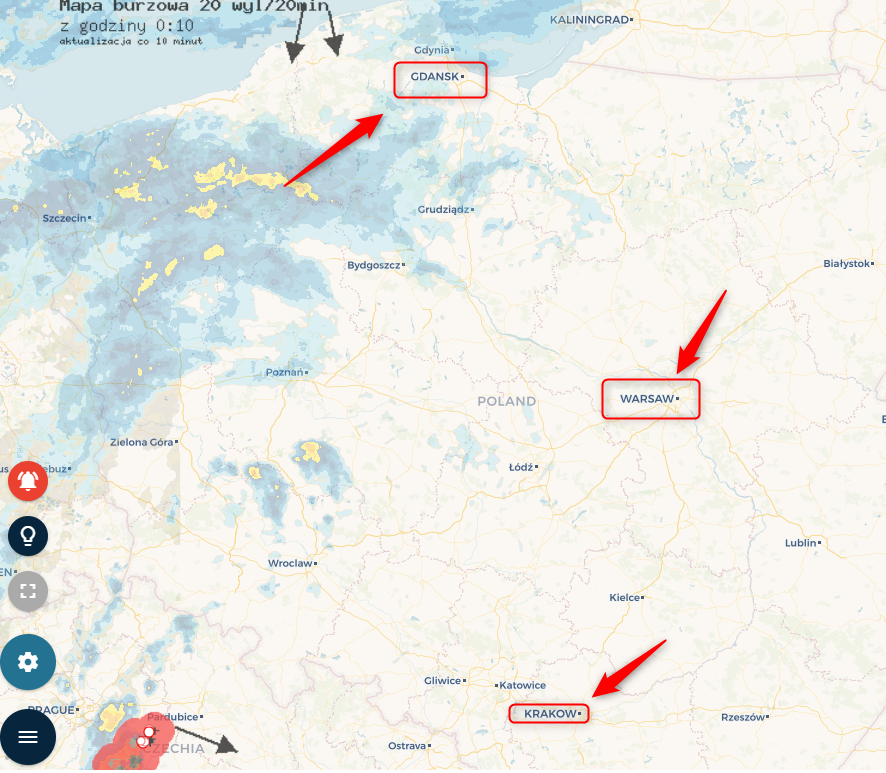

System Operacyjny:  
Windows 10 Home Edition  

Przeglądarka(i) internetowa:  
Opera 67.0.3575.115  
Chrome 80.0.3987.163  
Microsoft Edge 44.18362.449.0  

Kroki do odtworzenia:  
1. Użytkownik wchodzi na stronę obserwatorzy.info   

Aktualny rezultat:  
Nazwy niektórych miast są niepoprawne (np. Gdansk, Krakow,) lub są w innym języku niż język polski (brak spójności językowej np. Warsaw)  

Oczekiwany rezultat:  
nazwy miast są wyświetlane poprawnie, w języku polskim  

Powtarzalność:  
Zawsze  

Screeny:

