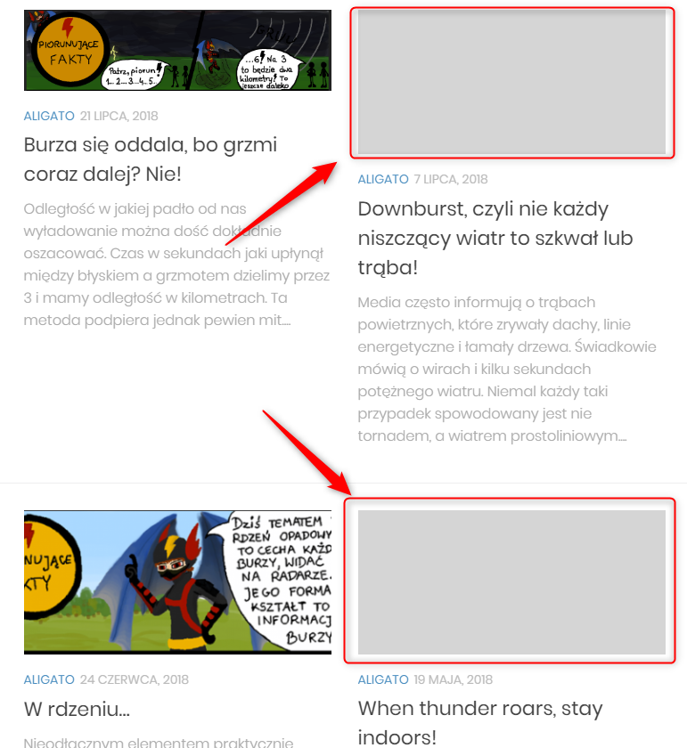

System Operacyjny:  
Windows 10 Home Edition  

Przeglądarka(i) internetowa:  
Opera 67.0.3575.115  
Chrome 80.0.3987.163  
Microsoft Edge 44.18362.449.0  

Kroki do odtworzenia:  
1. Użytkownik wchodzi na stronę obserwatorzy.info   
2. Użytkownik przechodzi do zakładki "ALIGATO" (https://obserwatorzy.info/category/aligato/)
LUB do zakładki "EDUKACJA" (https://obserwatorzy.info/category/edukacja/)

Aktualny rezultat:  
Część wpisów nie posiada dobrze podpiętych (podlinkowanych) obrazków w artykułach (szare prostokaty)  

Oczekiwany rezultat:  
Wszystkie artykuły posiadają dobrze  podpięte (podlinkowane) obrazki  

Powtarzalność:  
Zawsze  

Screeny: 

