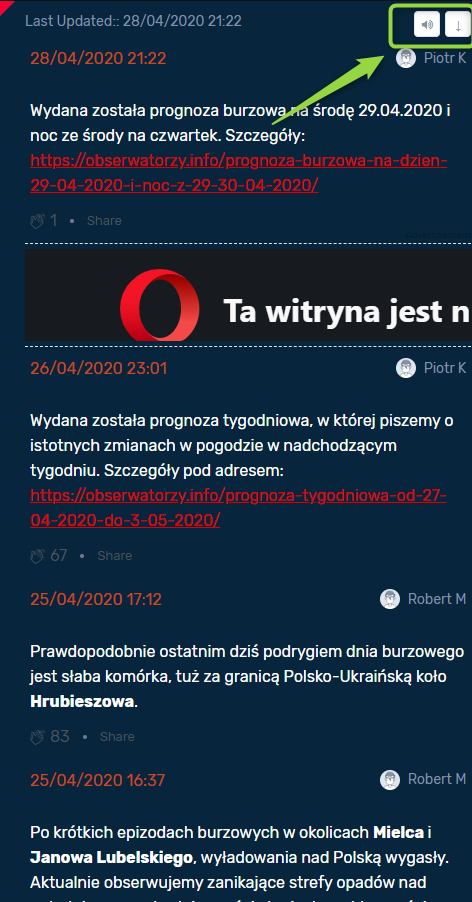

System Operacyjny:  
Windows 10 Home Edition  

Przeglądarka(i) internetowa:  
Opera 67.0.3575.115  
Chrome 80.0.3987.163  
Microsoft Edge 44.18362.449.0  

Kroki do odtworzenia:  
1. Użytkownik wchodzi na stronę obserwatorzy.info   
2. Użytkownik najezdża kursorem myszki na ikonkę "głośniczka" i/lub "strzałki" w sekcji "relacja na żywo"  

Aktualny rezultat:  
Po najechaniu na ikonkę (button)"głośniczka" i/lub "strzałki" brak dodatkowej informacji o funkcji danej ikonki (buttona)  

Oczekiwany rezultat:  
Po najechaniu na ikonkę (button)"głośniczka" i/lub "strzałki" wyświetla się krótki opis ich funkcjonalności.  

Powtarzalność:  
Zawsze  

Screeny:  
 

