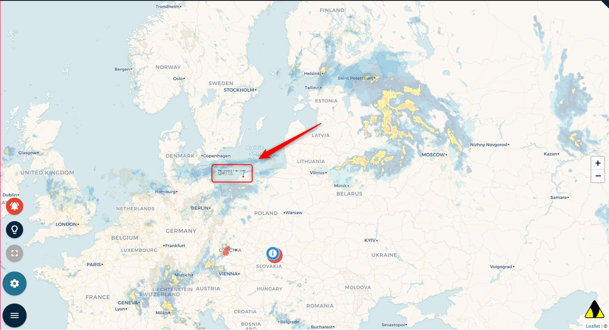
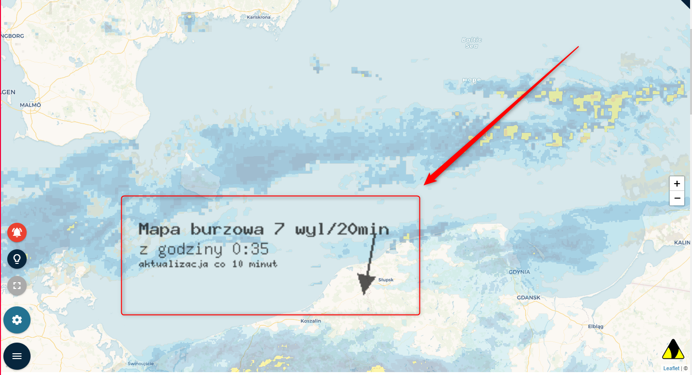

System Operacyjny:  
Windows 10 Home Edition  

Przeglądarka(i) internetowa:  
Opera 67.0.3575.115  
Chrome 80.0.3987.163  
Microsoft Edge 44.18362.449.0  

Kroki do odtworzenia:  
1. Użytkownik wchodzi na stronę https://obserwatorzy.info/  
2. Na dynamicznej mapie burzowej robi Zoom out LUB zoom IN  

Aktualny rezultat:  
Opis aktualizacji na "dynamiczna mapa burzowa" nie jest responsywny, jest "na sztywno" przyczepiony do mapy, dodatkowo zmniejsza się lub powiększa wraz z mapą przy jej zbliżaniu i oddalaniu.  

Oczekiwany rezultat:  
FEATURE: Opis aktualizacji na "dynamiczna mapa burzowa" jest gdzieś obok mapy (pod/nad oknem mapy?)  

Powtarzalność:  
Zawsze  

Screeny: 

