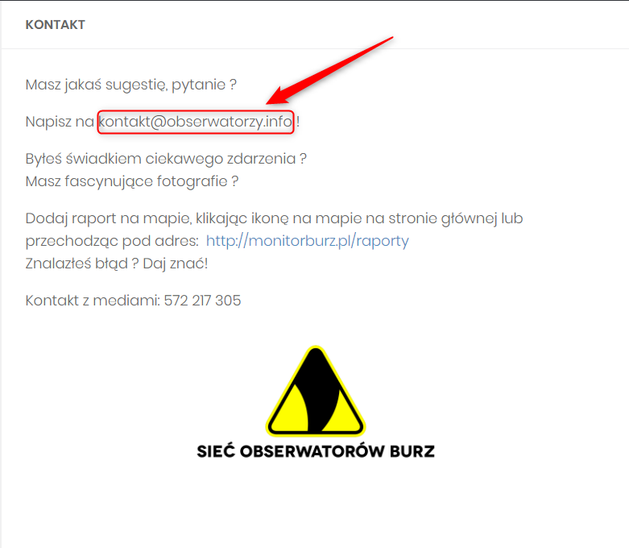

System Operacyjny:  
Windows 10 Home Edition  

Przeglądarka(i) internetowa:  
Opera 67.0.3575.115  
Chrome 80.0.3987.163  
Microsoft Edge 44.18362.449.0 

Kroki do odtworzenia:  
1. Użytkownik wchodzi na stronę obserwatorzy.info          
2. Z górnego tray bara wybiera "KONTAKT"  

Aktualny rezultat:  
Podany adres mailowy podany w zakładce "KONTAKT" jest zwykłym tekstem.  

Oczekiwany rezulat:  
Po kliknięciu w podany adres mailowy, użytkownik jest przekierowywany do wybranego przez siebie (sugerowanego) klienta pocztowego.  

Powtażalność:  
Zawsze

Screeny:  

