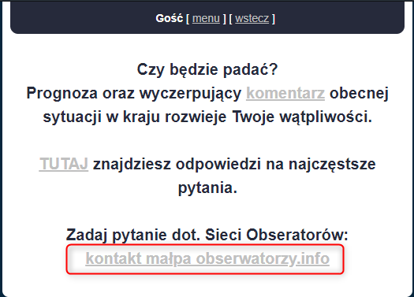

System Operacyjny:  
Windows 10 Home Edition  

Przeglądarka(i) internetowa:  
Opera 67.0.3575.115  
Chrome 80.0.3987.163  
Microsoft Edge 44.18362.449.0  

Kroki do odtworzenia:  
1. Użytkownik wchodzi na stronę obserwatorzy.info          
2. Z górnego tray bara wybiera "WYŚLIJ RAPORT"  
3. następnie wybiera "ZADAJ PYTANIE"  

Aktualny rezultat:  
Podany email brzmi następująco "kontakt małpa obserwatorzy.info"  

Aktualny rezultat:  
Podany email brzmi następująco "kontakt@obserwatorzy.info"  

Powtarzalność:  
Zawsze  

Screeny:

