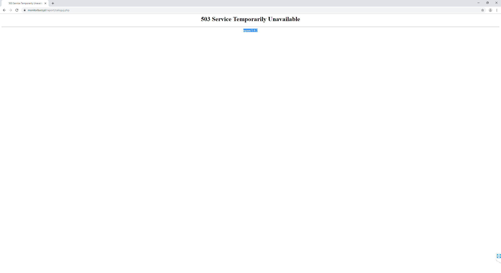

System Operacyjny:   
Windows 10 Home Edition  

Przeglądarka(i) internetowa:   
Opera 67.0.3575.115  
Chrome 80.0.3987.163  
Microsoft Edge 44.18362.449.0  

Kroki do odtworzenia:  
Użytkownik znajduje się na stronie: https://monitorburz.pl/raport/index.php
Użytkownik kilkakrotnie wciska przycisk "Zaloguj się" bez wypełniania wymaganych pól.  

Aktualny rezultat:  
Po kilkukrotnym szybkim wciśnięciu przycisku "Zaloguj się" przy braku wypełnionych danych pojawia się błąd 503.  

Oczekiwany rezultat:  
Przycisk "zaloguj się" jest nieaktywny, do momentu uzupełnienia wymaganych pól  

Screeny:  

