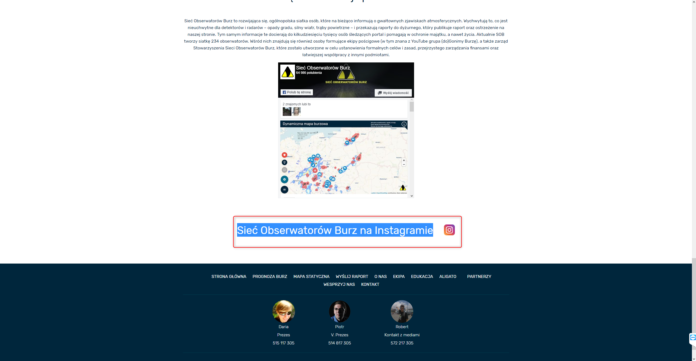

System Operacyjny:   
Windows 10 Home Edition  

Przeglądarka(i) internetowa:   
Opera 67.0.3575.115  
Chrome 80.0.3987.163  
Microsoft Edge 44.18362.449.0  

Kroki do odtworzenia:  
Użytkownik znajduje się na stronie: https://obserwatorzy.info/
Scrolujemy się na sam dól strony. Napis " Sieć Obserwatorów Burz na Instagramie jak i sama ikonka (symbol) instagram po wciśnięciu nie przekierowują na odpowiedni profil. Dostępnych jest tylko kilka obrazków udostępnionych poniżej.  

Aktualny rezulat:  
Odnośnik (instagram) jest nieaktywny.  

Oczekiwany rezultat:  
Po wciśnięciu w odnośnik (Instagram) użytkownik jest przekierowywany do odpowiedniej witryny   

Screeny:  

