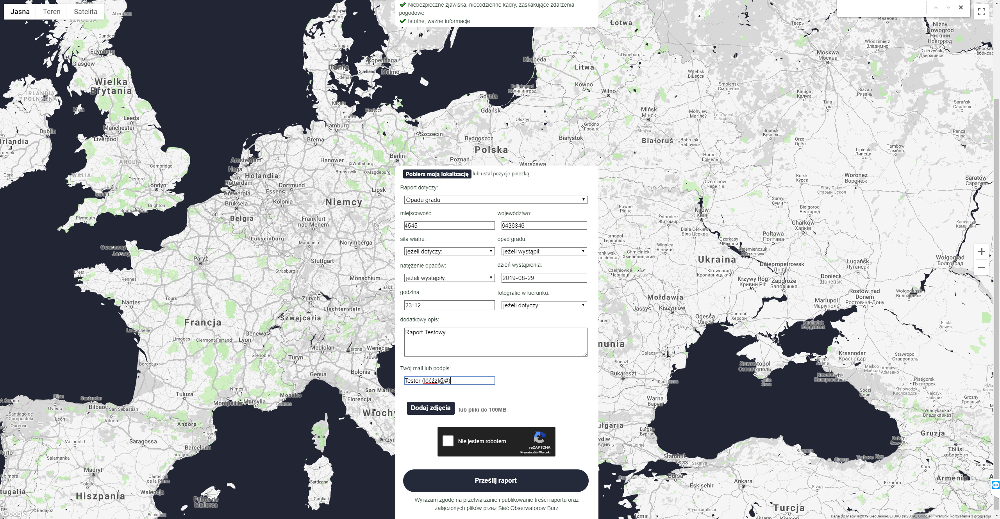
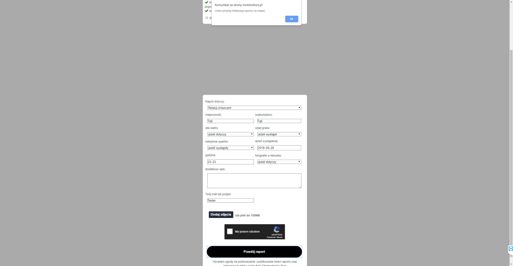

System Operacyjny:   
Windows 10 Home Edition  

Przeglądarka(i) internetowa:   
Opera 67.0.3575.115  
Chrome 80.0.3987.163  
Microsoft Edge 44.18362.449.0  

Kroki do odtworzenia:  

Użytkownik znajduje się na stronie: https://obserwatorzy.info/
Wybiera zakładkę "wyślij raport ---> "Wyślij nowy raport"  

Brak informacji o "mapie". Mapa z wyborem lokalizacji pojawia się po zaznaczeniu boxa z "Znam powyższe wytyczne". Przy wpisaniu danych dot. miejscowości i województwa i próbie wysłania raportu pojawia się alert z informacją o "Ustaw pinezkę z lokalizacją"
Brak informacji odnośnie ilości znaków(bądź ograniczeniu co do ilości znaków) w "dodatkowym opisie".
Możliwość wprowadzenia danych z datą wsteczną (np. 1788 rok) oraz datą"" z przyszłości) (np. 2056 rok). (Sugerowane wybranie zakresu dopuszczalnych dat na temat zgłaszania wydarzeń)

Po wybraniu ""Pinezką"" lokalizacji, istnieje możliwość edycji danych "pobranych" przez pinezkę na dowolny ciąg znaków (np. liczby) i wysłaniu raportu z w/w danymi jako poprawnie wypełniony raport. 

Screeny:  

