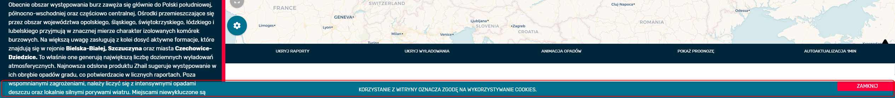

System Operacyjny:   
Windows 10 Home Edition  

Przeglądarka(i) internetowa:   
Opera 67.0.3575.115  
Chrome 80.0.3987.163  
Microsoft Edge 44.18362.449.0

Aktualny rezultat:  
Pasek z informacją odnośnie ciasteczek w sekcji "relacja na żywo""nie zasłania textu pod nim, text przebija przez pasek  

Oczekiwany rezultat:  
Pasek z informacjami o "ciasteczkach" jest nietransparentny na całej swojej długości  

Screeny:  

